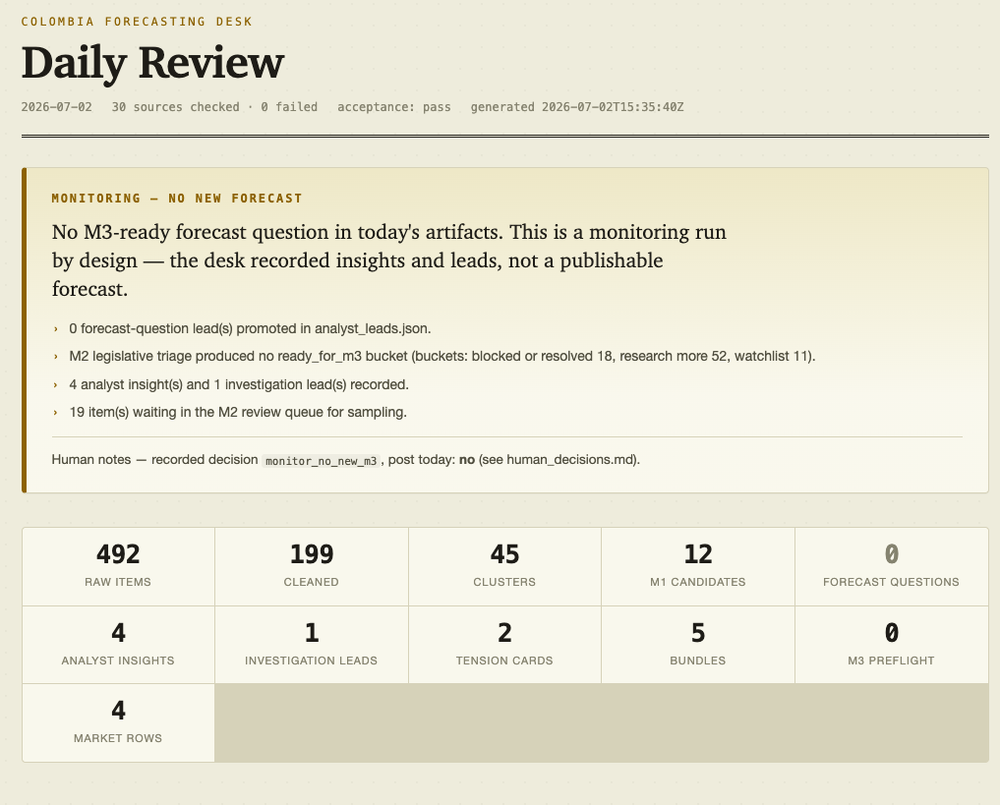
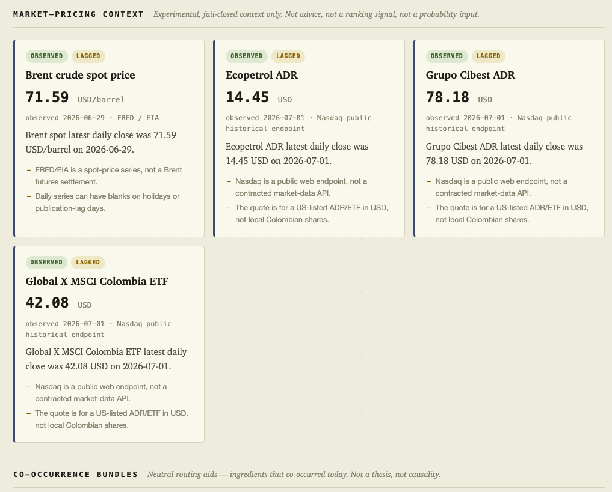

# Colombia Forecasting Desk

**An agent-assisted forecasting pipeline that reads Colombia's official sources every day — central bank, congress, statistics agency, official gazette, public procurement — and turns them into evidence-backed forecast questions a human (or LLM) can actually judge.**

Every morning the pipeline fetches ~30 official and public sources, cleans and
deduplicates them, reconciles legislative bill identities, tracks economic
indicators, flags cross-source tensions, and produces a ranked, fully traceable
review packet. A deterministic HTML review surface (`review.html`) summarizes
each run at a glance. Editorially, the desk prefers public-interest forecast
hooks — a pending decision, cost/input pressure, a contradiction between
credible sources, a named entity with a clear institutional path — over merely
clean indicator continuation.



*A monitoring day: when no candidate is ready, the desk records "no publishable
forecast" explicitly instead of inventing one.*

## Design principles

The interesting part isn't the scraping — it's the guardrails:

- **Deterministic by default.** Rendering and ranking are pure functions of the run artifacts: no LLM, no network, byte-stable outputs. Regenerated runs can be compared with an artifact parity guard.
- **Fail-closed, never silent.** A single broken source never crashes a run; every failure is surfaced in `source_failures.json` and per-source health counts, so silence is never mistaken for "nothing happened."
- **Advisory, not authoritative.** Heuristic scores, cross-impact hypotheses, and tension cards are labeled as review prompts — the human/LLM reviewer is explicitly told to read the underlying source excerpts before trusting them.
- **Contracts everywhere.** Legislative records, M3 evidence packs, and final outputs each have documented contracts with validation scripts and a pytest suite behind them.



*Advisory in practice: market context ships with observed/lagged badges and
explicit caveats — "not a probability input", "not a contracted market-data
API" — so the reviewer inherits the limits along with the numbers.*

Built with Python 3.12 + [`uv`](https://docs.astral.sh/uv/). See
[`PROJECT_SPEC.md`](PROJECT_SPEC.md) for the full vision and milestones, and
[`docs/`](docs/) for the detailed contracts.

## Quickstart

Requires Python 3.12 and [`uv`](https://docs.astral.sh/uv/).

```bash
uv sync
uv run pytest -q
uv run python scripts/scan_metasources.py
uv run python scripts/scan_metasources.py --source-report
uv run python scripts/render_review.py    # deterministic HTML daily review + recent-runs index
```

`render_review.py` writes `runs/YYYY-MM-DD/review.html` (the daily TLDR) and
`runs/review_index.html` (recent-runs trends) from artifacts a run already
produced. It is a pure renderer: no LLM, no network, no new dependency, and
byte-stable for a given set of artifacts. Open either file directly in a
browser; `--date`, `--window N`, `--daily-only`, and `--index-only` control
what gets rendered. See
[`docs/REVIEW_SURFACE.md`](docs/REVIEW_SURFACE.md) for what each section means
and the guardrails it preserves.

Each run writes a dated folder under `runs/YYYY-MM-DD/` with ~25 traceable
artifacts, from raw fetches to the final analyst leads. The full catalog — plus
the artifact parity guard and M3 evidence-pack validation commands — is
documented in [`docs/RUN_ARTIFACTS.md`](docs/RUN_ARTIFACTS.md).

### Optional flags

```bash
uv run python scripts/scan_metasources.py --date 2026-04-27 --config config/metasources.yaml --source-report
uv run python scripts/scan_metasources.py --date 2026-04-27 --strict
```

`--strict` exits nonzero when M1 hard gates fail. It checks both candidate
quality and operational coverage: malformed candidates, link-only evidence
promoted as forecastable, too few raw/cleaned/rankable items in a full run, too
many source failures, too few observed Indicator Watch cards, or excessive
high-impact source failures.

## Project layout

```
colombia_forecasting_desk/   # core package (config, cleaner, dedupe, cluster, ranker, brief, pipeline)
  fetchers.py                # compatibility import path for source fetching
  observability.py           # run_trace.json stage/source diagnostics
  source_fetching/           # source fetching and source-specific parser internals
config/metasources.yaml      # registry of public sources (enabled/disabled, fetch_method, priority, trust_role)
scripts/scan_metasources.py  # M1 entry point
scripts/check_artifact_parity.py # stable generated-artifact comparison guard
scripts/validate_m3_case_file.py # M3 evidence-pack readiness contract guard
prompts/                     # placeholder prompts (used in later milestones)
runs/YYYY-MM-DD/             # generated run artifacts (gitignored content)
forecasts/                   # forecast log (used in later milestones)
tests/                       # pytest suite
```

`colombia_forecasting_desk.fetchers` remains the supported import path used by
the pipeline, tests, and workflow snippets. Its implementation is staged under
`colombia_forecasting_desk/source_fetching/` so future source-family parser work
can be moved behind clearer boundaries without changing the daily command. The
current split keeps shared helpers in `common.py`, dispatcher functions in
`core.py`, and source-family logic in modules such as `dane.py`, `imprenta.py`,
`minhacienda.py`, `mincit.py`, `registries.py`, `rss.py`, and `socrata.py`.
Fetcher parser tests mirror that boundary: generic dispatcher/facade coverage
stays in `tests/test_fetchers.py`, while source-family parser cases live in
`tests/test_fetchers_*.py` files.
Indicator Watch's static catalog lives in
`colombia_forecasting_desk/data/indicator_catalog.json`; golden fixtures under
`tests/fixtures/indicator_watch/` pin the card order, component defaults, and
selected runtime summaries before catalog edits.

## Status

Currently at **M2.7 — experimental market-pricing context for M2**, building on the
M1.20 legislative registry pipeline, M1.21 MinCIT zonas-francas parser, M1.22
official legal-resolution bridge, and M1.23 GDP/ISE Indicator Watch coverage. The
official Senado Sección de Leyes and Cámara Proyectos de Ley registries now
provide primary structured bill identity/status records; Senado agenda PDFs and
Gacetas remain fallback/follow-up evidence. The MinCIT zonas francas source
parses the official approved-zones PDF into named registry rows with NIT,
location, declaratory/prórroga resolutions, and legal follow-up sources, while
promoting only future new/changed snapshot rows as current decision signals.
Those registry changes now feed `analyst_leads` as conservative zona-franca
land-use insights before any M3 forecast decision.
Diario Oficial PDFs, SUIN/Gestor legal rows, and MinCIT rows now share
normalized legal-act identities so official resolution matches can be attached
only when the act number/year and MinCIT or zone-name context agree. DIAN
regulatory-project coverage is source-specific instead of broad site
navigation, but still marked as parser feasibility rather than rankable
evidence. DANE PIB and ISE official pages are now first-class Indicator Watch
cards, including PIB sector drivers and current-release official document
links, so GDP/ISE releases can become M2-ready activity seeds instead of only
appearing as indirect context. Legislative records now also get an advisory M2
ranking with explicit score reasons, review buckets, and heuristic-risk audit
flags. M2.4 keeps that content-first review packet but balances the queue across
legislative records, indicator seeds, event leads, and conservative
cross-impact hypotheses and deterministic Indicator Tension Cards. Those
hypotheses and cards are review prompts only, not causal claims or probability
inputs, so humans and LLMs can challenge brittle rules instead of inheriting
them silently. See
[`docs/M1_METASOURCE_PIPELINE.md`](docs/M1_METASOURCE_PIPELINE.md) for the
detailed plan, the
[`Legislative Reconciler Contract`](docs/LEGISLATIVE_RECONCILER_CONTRACT.md)
for the legislative identity/status contract, and
[`PROJECT_SPEC.md`](PROJECT_SPEC.md) for upcoming milestones (M2 question
discovery, M3 evidence packs, M4 public X experiment).
